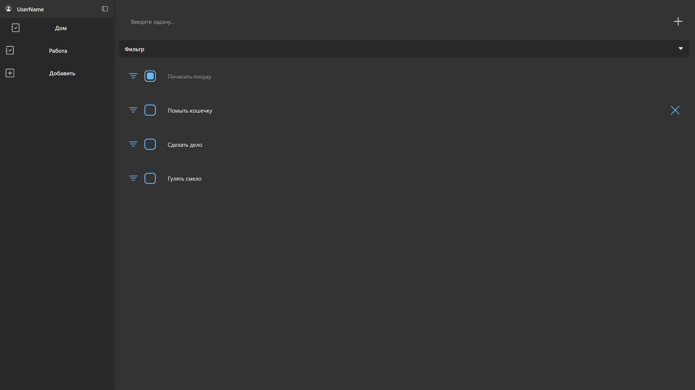

# 📝 ToDoList AI+IMG

Современное веб-приложение для управления задачами с расширенным функционалом: фильтры, drag&drop, светлая/тёмная тема и возможность работать с изображениями с помощью AI-интеграции.  

## 🚀 Демо  
🔗 [Открыть приложение на Vercel](https://your-vercel-link.vercel.app)  
📷 Скриншот интерфейса:  
  

---

## ⚡ Функционал

- ➕ Добавление, редактирование и удаление задач  
- ✅ Отметка выполненных задач  
- 🔍 Фильтры (все / активные / завершённые)  
- 📂 Сортировка по дате и приоритету  
- 🎨 Светлая / тёмная тема  
- 📦 Сохранение данных в `localStorage`  
- 🖼 Загрузка изображений к задачам (с интеграцией AI-генерации)  
- 🖱 Drag & Drop (перетаскивание задач как в Trello)  
- 📱 Полностью адаптивный дизайн  

---

## 🛠️ Стек технологий

- **React 19** (хуки, функциональные компоненты)  
- **TypeScript** (опционально, если подключишь)  
- **React Router** — маршрутизация  
- **Redux Toolkit / Zustand** — управление состоянием  
- **React Beautiful DnD** — drag & drop  
- **Jest + React Testing Library** — тестирование  

---

## 📦 Установка и запуск

```bash
# клонировать проект
git clone https://github.com/gzdewww/todolist-ai-img.git
cd todolist-ai-img

# установка зависимостей
npm install

# запуск локально
npm start

# сборка production
npm run build
```

---

## 🧪 Тестирование

```bash
# запустить тесты
npm test
```

---

## 📂 Структура проекта

```
src/
 ┣ components/     # UI-компоненты (Task, TaskList, FilterPanel, ThemeToggle)
 ┣ hooks/          # кастомные хуки (useLocalStorage, useTheme)
 ┣ pages/          # страницы приложения
 ┣ styles/         # глобальные стили
 ┣ utils/          # вспомогательные функции
 ┗ App.js          # основной компонент приложения
```

---

## 📌 Что можно доработать

- 🔑 Авторизация (JWT / Firebase)  
- ☁️ Сохранение задач в облаке (Supabase / MongoDB Atlas)  
- 🔔 Push-уведомления  
- 📊 Статистика (графики выполненных задач)  

---

## 👤 Автор

Проект разработан [@gzdewww](https://github.com/gzdewww) в рамках учебного портфолио.  
Буду рад обратной связи и предложениям по сотрудничеству! 🚀  
